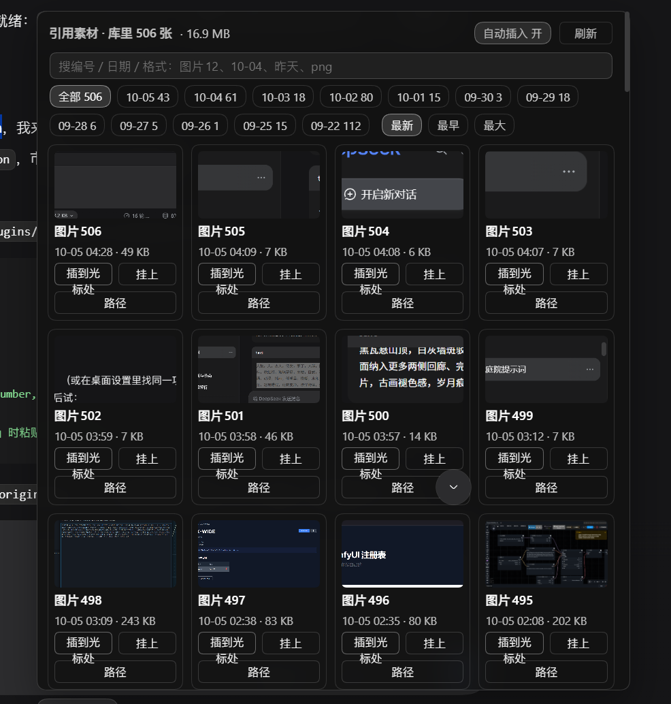
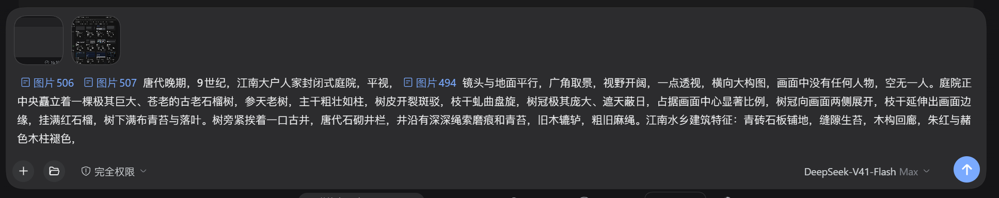
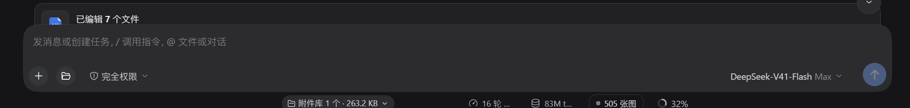

<div align="center">

English | [简体中文](README.md)

</div>

# dsh-picflow

<p align="center">
  
</p>

## In one line

Paste a screenshot and reference it by number: every `Ctrl+V` image is stored in the attachment library, gets a stable number (`图片N`), appears in a thumbnail panel next to the composer, and can be dropped into your text as a native reference chip at the caret.

## Why it exists

`Ctrl+V` an image into the composer and the harness keeps it as a **runtime-only draft attachment** — an in-memory object URL whose bytes are uploaded only when you press send. Until that moment the attachment library on disk does not contain it, so nothing can point at it: the `@` menu has no entry for it, and there is no number by which you could say "the screenshot I pasted just now".

So you end up describing images in prose — "the first one", "image 2" — which breaks the moment there are three of them, and breaks differently the moment you switch conversations and come back.

dsh-picflow closes exactly that gap: the image is admitted to the official store **at paste time**, the number it gets is the same number it will have after you send it, and one click (or none, with auto-insert on) puts that number into your text.

## What it does

- **Admits pasted images immediately.** A 350 ms sweep reads the composer's live draft attachments and POSTs the bytes to the plugin's own host route, which calls the official `attachments.saveImage`. Same normalization, same sha256, same object as the copy that appears when you finally send — so there is no duplicate entry, and the number never changes.
- **Stable numbering.** `图片N` is assigned over the whole library sorted by file mtime ascending: the oldest image is `图片1`. New images only ever get *higher* numbers, so a number you wrote yesterday still means the same picture today.
- **A thumbnail panel in the composer dock.** The `N 张图` pill expands into `引用素材`: newest first, one cell per image with its number, time and size, plus `插到光标处`, `挂上` (re-attach that stored image to the current message so the model sees the picture itself) and `路径` (copy the markdown reference). Click a thumbnail for a full-screen overlay (click or `Esc` to close).
- **Search and filters.** `图片12`, `10-04`, `昨天`, `png`, a sha prefix, a size in `kb` — plus per-day chips and `最新 / 最早 / 最大` sorting. Paging loads 120 at a time.
- **An `@图片` source.** Typing `@` offers a `图片` group; picking an entry inserts the same numbered reference chip, identical to what the panel button does.
- **Auto-insert (default on).** With the switch on, admission is followed by the reference chip landing at your caret and the panel staying out of the way. Turn it off in the panel header (`自动插入 开/关`) and pasting only stores the image — you click when you want it. The choice is remembered in `localStorage`.
- **Honest about the trade-off.** Because admission happens at paste time, **an image enters the library even if you never send it.** That is the point — but it is a real behaviour change, so it is stated here rather than discovered later.

<p align="center">
  
</p>

<p align="center">
  
</p>

## Install

```sh
curl -fsSL https://raw.githubusercontent.com/XWIDE/dsh-picflow/main/install.sh | sh
```

**Desktop app (Windows)** — the desktop build does not put `dsh` on PATH, so the line above cannot run there. Use this instead:

```powershell
iwr https://raw.githubusercontent.com/XWIDE/dsh-picflow/main/install.ps1 -useb | iex
```

It drives the plugin operations that ship inside the application (`resources\app\lib\plugin-cli.js`), so it needs nothing beyond PowerShell 5.1 and an installed DSH NEXT. Pass `-Remove` to uninstall.

Manual equivalents:

```sh
dsh plugin --profile web add git+https://github.com/XWIDE/dsh-picflow.git
```

```powershell
$exe = "$env:LOCALAPPDATA\Programs\DSH NEXT\DSH NEXT.exe"
& $exe --expose-internals "$((Get-Item $exe).Directory.FullName)\resources\app\lib\plugin-cli.js" desktop add github:XWIDE/dsh-picflow
```

Then **restart the app hosting the plugin once** — the host half registers HTTP routes at startup:

- **DSH desktop app**: restart DSH NEXT (its title-bar restart menu also has *Reload interface*, which is enough for the browser half only).
- **`dsh web`**: restart the `dsh` process.

There is no build step and no runtime dependency, so a source install works as-is: no `allowBuilds` prompt.

## How it works

| Piece | What it does |
| --- | --- |
| `GET  /plugins/dsh-picflow/version` | Cheap library fingerprint (`readdir` + `stat` of the shard directories only). The client polls it every 3 s and refetches the list when it changes. |
| `POST /plugins/dsh-picflow/admit` | Body = the image bytes. Sniffs the format from the bytes (never from `content-type`), calls the official `attachments.saveImage`, returns `{sha, ordinal, label, bytes, ext, path?}`. |
| `GET  /plugins/dsh-picflow/images` | The list: `limit`, `materialize`, `offset`, `q`, `day`, `source`, `sort`, `pin`, `session`. `materialize=N` copies the first N rows into the workspace; `pin=<sha>` copies exactly one. |
| `GET  /plugins/dsh-picflow/raw` | The bytes, with the media type sniffed from the file itself. |

All four sit behind the host trust fence: loopback only, unless you list an authority in `trustedHosts`.

`插到光标处` needs a path the model can read, so the host keeps a copy of the image inside your workspace at `<workspace>/.dsh/pics/pic-<MMDD-HHMM>-<sha8>.<ext>` (skipped when an identical copy is already there) and inserts a `dsh-resource://file/absolute/...` reference chip pointing at it.

## Compatibility

| dsh-picflow | Harness | Notes |
| --- | --- | --- |
| 0.1.0 | **0.2.0-rc.2 (measured)** | Developed and tested against the desktop build of `0.2.0-rc.2`: `install` and `start` verified on a real profile, `uninstall` / `rollback` declared `unknown` because they have not been exercised on this release. |

Requires Node.js 22.19+ or 24+ for the host half (the same floor the harness CLI itself runs on).

The client half is loaded by the host's module loader and calls `require('react')`; it declares no npm dependencies, and no official `@deepseek-ai/*` package is pinned, so a version skew in the host roster cannot break the install.

## Configuration

```yaml
- id: picflow
  name: 'dsh-picflow'
  config:
    trustedHosts: []        # authorities allowed to reach the plugin routes besides loopback,
                            # e.g. ["my-box.local:3080", "192.168.1.20:3080"] — host[:port]
```

Reaching a route from a non-loopback origin without listing it answers `403` with the exact line to add.

Everything else is discovered, not configured: the attachment library is read from `DSH_HOME` (falling back to `~/.dsh`) at `attachments/v1`, and materialized copies go to the session's own workspace.

## Limits

- **Formats**: PNG, JPEG, WebP, GIF. BMP is not accepted by the official attachment store, so `/admit` answers `400 unsupported-image`. Disguised files are rejected by content sniffing, not by extension.
- **Size**: 20 MB per image in the official store; the `/admit` request body is capped at 24 MB (`413 body-too-large`).
- **List**: 60 rows per request by default, 400 maximum; the panel pages 120 at a time.

## Privacy

Nothing leaves your machine. The plugin reads the local attachment library, writes copies under the session workspace, and talks only to the host's own loopback routes. No telemetry, no external endpoint, no image is re-uploaded anywhere.

The two pieces of local state it keeps are `<workspace>/.dsh/pics/` (image copies, so references resolve) and one `localStorage` key, `dsh-picflow.autoInsert`, for the switch.

## Troubleshooting

- **The panel says the host half is old** — the client half is newer than the loaded host module. Restart the app; a page refresh cannot reload host code.
- **`403` from a LAN address** — add that `host[:port]` to `trustedHosts` (the response prints the line to copy).
- **Pasted image never appears in the panel** — the composer's draft attachments are the source, so the paste has to have landed in the message box of the *current* session. The panel's `刷新` button forces a refetch, and `@图片` reads the same list.
- **`插到光标处` answers "还没落盘副本"** — the reference needs a file path; if the session has no workspace to copy into, the plugin offers the plain markdown form instead.
- **Auto-insert did not fire** — it steps aside instead of fighting you: if the composer is busy (a turn is streaming) or the caret is not in the input, the panel opens and tells you why, so you can place it with one click.
- **An image you pasted but deleted is in the library** — expected, see the trade-off above. Deleting the object from the store removes it from the panel.

## Development

```sh
node tests/host.mjs     # host routes: 24 checks
node tests/chip.mjs     # client half: 78 checks (fake loader + fake React, no browser)
```

Both suites run on plain Node with no dependencies.

## Uninstall

```sh
dsh plugin --profile web remove dsh-picflow
```

Delete `<workspace>/.dsh/pics/` if you also want the materialized copies gone; the images themselves live in the official attachment library and are left alone.

## License

MIT — see [LICENSE](LICENSE).

## Author

**X-WIDE** — GitHub [@XWIDE](https://github.com/XWIDE) · bilibili [374064919](https://space.bilibili.com/374064919) · xiupk@sina.com.cn

Issues and feature requests are welcome.
